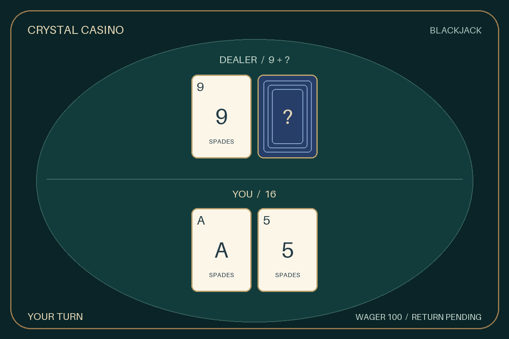
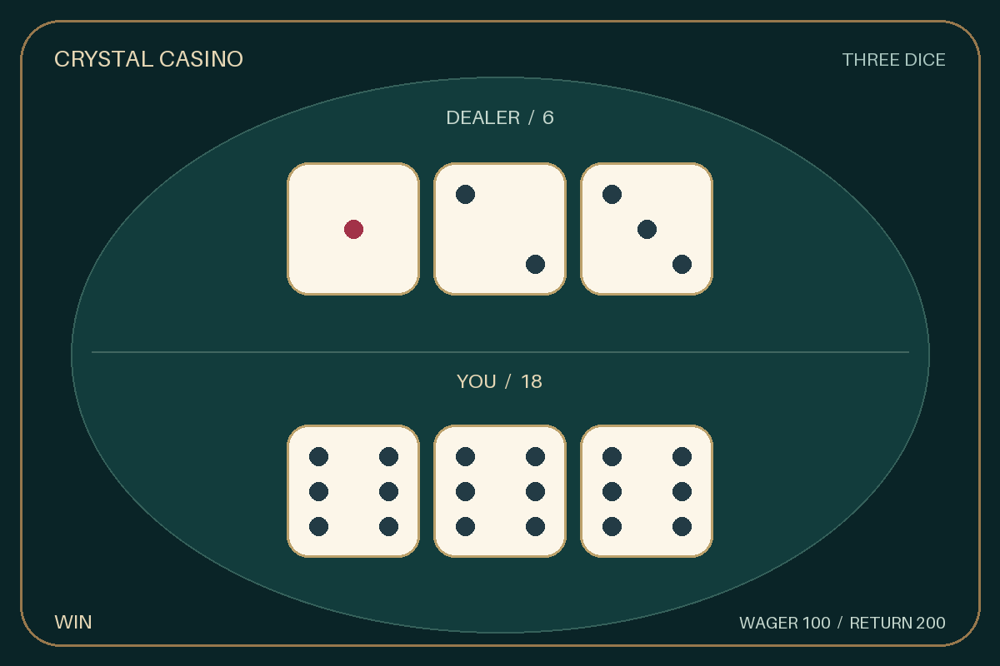

# Issue #8 驗證與交接

日期：2026-09-06。實作前基準：7367205376299c5059d665505ab2de1a73d11cd9。

## 交付

- 21 點操作已接入 CasinoStore：單副牌、天然、要牌／停牌／首兩張加倍、軟 17 停牌。
- cards 保存原牌組／雙方手牌／操作；deadline 保存玩家期限，version 是一次性操作邊界。
- 原下注仍由 base／multiplier 表示，wager 為累計下注。double 每局最多一筆，派彩／退款共用唯一返還約束。
- 遷移保留 v1 骰子資料，加入 cards／deadline 並更新 wager／ledger 約束；啟動 check 會拒絕 v1。
- Game 是公開投影：進行中莊家只含明牌與 None，沒有剩餘牌組。圖片和文字只使用此投影。
- 每次開啟大廳從全部六張 Mei JPEG 隨機取一張，可連續抽到相同圖片。
- 兩款遊戲圖片在背景執行緒合成，素材预載且可替換；缺失時有內建牌桌、牌背、牌面與骰子佔位圖。
- 圖片／上傳失敗只回退文字；不重扣、不重抽、不影響持久結果。每訊息有版本／上傳鎖，較慢舊圖片不覆蓋新結果。
- 背景每兩秒掃描到期牌局。重啟後仍會結算未完局；重啟前的 Discord interaction 不會持久保存，舊訊息可用重新 /賭場 恢復。

## 測試證據

採父規格已確認的操作契約、Discord interaction 替身與隔離 PostgreSQL 三個邊界。
新增切片先觀察失敗，再實作通過；所有資金測試使用 casino_test_<UUID> schema，不寫入 public。

第一輪新增 8 項真實 PostgreSQL 測試全部通過，耗時 223.558 秒；舊 schema 升級另一次通過，耗時 34.698 秒。
涵蓋天然、雙天然、爆牌、普通 21、軟 A、莊家補牌、加倍去重／原注再開、非法操作、期限恢復、逾時競爭、COMMIT 前後故障與全額退款。
後續完整測試另涵蓋牌組／期限 binary COPY 備份還原、兩款遊戲圖片失敗後恢復與唯一再開。

審查後 7 項圖片／互動測試全部通過；新增兩項回歸分別驗證先 defer 再等鎖、骰子文字回退保留總和。
五個程式模組 mypy 通過；修改檔案通過嚴格 UTF-8 解碼及替代字元檢查，git diff --check 通過。
完整測試的最終結果記錄於本文件末段。

## 圖片檢查與延遲

本機 Windows、專案 Python 3.10、Pillow 12.3.0，使用 1200×800 內建佔位牌桌。
暖快取固定 21 點合圖 30 次：中位數 10.58 ms、最大 16.28 ms，PNG 34,171 bytes。
這是本機合圖數字，沒有宣稱 Discord 網路更新延遲或承載量；部署後可從 compose_ms／update_ms 日誌量測。
合成及上傳失敗、圖片亂序以受控故障和 interaction 替身驗證；沒有把替身 0.x ms 當成真實 Discord 更新時間。

固定牌局預覽已目視確認置中、可讀點數與暗牌只顯示牌背：

## Standards

獨立審查沒有硬性規範違反；一項訊息追蹤 tuple 的維護性建議已採納為 ActiveMessage 具名欄位。
複查剩餘 0 項發現。

## Spec

獨立審查找到兩項實作缺陷：slash 等鎖前未 defer、骰子回退缺少圖片總點數。
兩項都有先失敗後通過的回歸測試，修正後複查剩餘 0 項實作發現。

## 待部署驗收

- 尚未對正式資料庫備份／還原或執行 migrate；隔離 schema 測試不等於正式維護。
- 尚未啟動正式 Bot 或在 Discord 測試伺服器驗收手機／桌面、公開／ephemeral 與真實更新延遲。
- Mei 為使用者提供的六張荷官圖片；牌桌、牌面及骰子仍是可替換佔位美術，不能宣稱已完成正式美術驗收。

後續 Issue #9 應使用 game 欄位分遊戲、wager 累計下注及 stake／double／payout／refund 四種流水，保留 active／settled／void 的區分。

## 最終測試結果

- RUN_DB_TESTS=1 完整 discovery：75 項全數通過，821.652 秒，沒有 skip；包含 34 項真實 PostgreSQL 測試。
- 上述執行期間完成兩項 UI 審查修正及新增回歸；修改後 RUN_DB_TESTS=0 完整 discovery：77 項中 43 項非 DB 通過、34 項 DB 明確 skip，0.831 秒。
- 因為修正僅涉及 UI 回應順序、文字總和與訊息追蹤型別，DB 實作未再更改；沒有宣稱另跑一次最終 77 項且零 skip 的完整測試。
- 審查修正後五個模組的 mypy 通過；Standards／Spec 複查均剩餘 0 項實作發現。
- 六張 Mei JPEG 均可解碼，皆為 1840×1432；隨機選圖測試確認每次呼叫都從六張圖池取樣。
